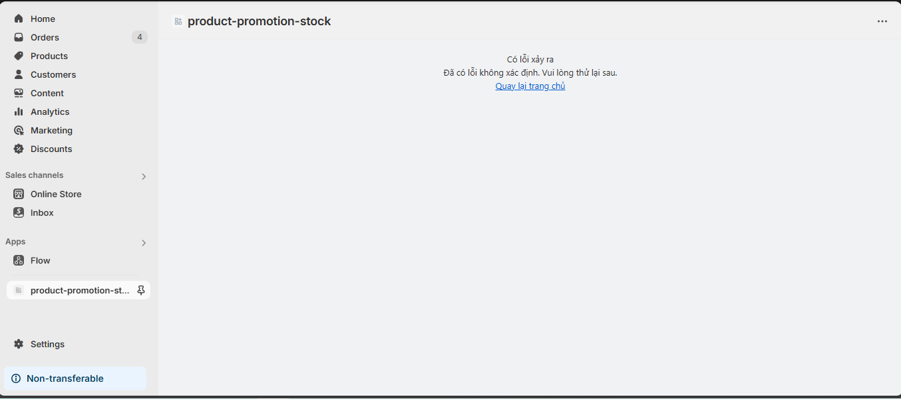

## Tuần 7 & Tuần 8: Project - Shopify App Hoàn chỉnh

### Xây dựng Shopify App - "Product Promotion & Stock Manager"

**Mục tiêu:**  
Xây dựng một Shopify Embedded App với các chức năng:

- Hiển thị danh sách sản phẩm từ Shopify
- Cập nhật thông tin sản phẩm (giá khuyến mãi / tồn kho)
- Tương tác với Shopify Theme (App Block / ScriptTag)
- Trang Dashboard sử dụng Polaris
- Xử lý Webhook khi sản phẩm bị xoá
- Validate input, handle error
- Chức năng OAuth đầy đủ

---

### ✅ Chức năng yêu cầu

#### 1. Authentication & OAuth

**Triển khai OAuth chuẩn với Shopify**

- Sử dụng package `@shopify/shopify-app-remix` để thiết lập OAuth flow.
- Lưu session/token vào database (SQLite/MySQL với Prisma).
- Tất cả API đều dùng middleware kiểm tra token hợp lệ.

**Ví dụ cấu hình:**

```ts
import "@shopify/shopify-app-remix/adapters/node";
import {
  ApiVersion,
  AppDistribution,
  shopifyApp,
} from "@shopify/shopify-app-remix/server";
import { PrismaSessionStorage } from "@shopify/shopify-app-session-storage-prisma";
import prisma from "./db.server";

const shopify = shopifyApp({
  apiKey: process.env.SHOPIFY_API_KEY,
  apiSecretKey: process.env.SHOPIFY_API_SECRET || "",
  apiVersion: ApiVersion.January25,
  scopes: process.env.SCOPES?.split(","),
  appUrl: process.env.SHOPIFY_APP_URL || "",
  authPathPrefix: "/auth",
  sessionStorage: new PrismaSessionStorage(prisma),
  distribution: AppDistribution.AppStore,
  future: {
    unstable_newEmbeddedAuthStrategy: true,
    removeRest: true,
  },
  webhooks: {
    PRODUCTS_DELETE: {
      deliveryMethod: "http",
      callbackUrl: "/webhooks/app/products-delete",
      callback: async (topic, shop, body, webhookId) => {
        // Xử lý logic khi sản phẩm bị xoá
      },
    },
  },
  ...(process.env.SHOP_CUSTOM_DOMAIN
    ? { customShopDomains: [process.env.SHOP_CUSTOM_DOMAIN] }
    : {}),
});

export default shopify;
export const apiVersion = ApiVersion.January25;
export const addDocumentResponseHeaders = shopify.addDocumentResponseHeaders;
export const authenticate = shopify.authenticate;
export const unauthenticated = shopify.unauthenticated;
export const login = shopify.login;
export const registerWebhooks = shopify.registerWebhooks;
export const sessionStorage = shopify.sessionStorage;
```

- Đảm bảo mọi route API đều dùng middleware `authenticate` để kiểm tra session/token.
- Token được lưu vào DB qua Prisma, đảm bảo bảo mật và dễ quản lý.

---

#### 2. Product Listing - Sử dụng Shopify Admin API

**Gọi API lấy danh sách sản phẩm**

```js
import { json } from '@remix-run/node';
import { authenticate } from '../shopify.server';

export async function loader({ request }) {
  const { admin, session } = await authenticate.admin(request);
  const { shop, accessToken } = session;
  if (!shop || !accessToken) {
    throw new Error('Phiên không hợp lệ: Thiếu shop hoặc accessToken');
  }
  const response = await admin.graphql(
    `#graphql
    query($first: Int, $sortKey: ProductSortKeys, $reverse: Boolean) {
      products(first: $first, sortKey: $sortKey, reverse: $reverse) {
        edges {
          node {
            id
            title
            createdAt
            featuredImage { url }
          }
          cursor
        }
        pageInfo {
          hasNextPage
          hasPreviousPage
          startCursor
          endCursor
        }
      }
    }`,
    {
      variables: {
        first: 5,
        sortKey: 'TITLE',
        reverse: false,
      },
    }
  );

  const { data, errors } = await response.json();
  if (errors) throw new Error(errors.map((e) => e.message).join(', '));

  return json({
    products: data.products.edges.map((edge) => edge.node),
    pageInfo: data.products.pageInfo,
  });
}
```

---

**Hiển thị bảng danh sách (Polaris DataTable)**

```js
// app/components/ProductsTable.js
import {
  DataTable,
  TextField,
  Button,
  Select,
  InlineStack,
  Page,
  Card,
  Link,
  Badge,
  Spinner,
  Icon,
} from '@shopify/polaris';
import { SearchIcon, ArrowLeftIcon, ArrowRightIcon } from '@shopify/polaris-icons';
import { useNavigate, useSubmit, useNavigation } from '@remix-run/react';
import { useState, useEffect } from 'react';

export function ProductsTable({ products, pageInfo, searchQuery, sortKey }) {
  const navigate = useNavigate();
  const submit = useSubmit();
  const navigation = useNavigation();
  const [searchValue, setSearchValue] = useState(searchQuery || '');
  const [sortValue, setSortValue] = useState(sortKey || 'TITLE');

  // Debounce search input
  useEffect(() => {
    const timer = setTimeout(() => {
      if (searchValue !== searchQuery) {
        submit({ search: searchValue }, { replace: true });
      }
    }, 500);

    return () => clearTimeout(timer);
  }, [searchValue]);

  // Handle sort change
  const handleSortChange = (value) => {
    setSortValue(value);
    submit({ sort: value }, { replace: true });
  };

  // Handle pagination
  const handlePagination = (direction) => {
    const cursor = direction === 'next' ? pageInfo.endCursor : pageInfo.startCursor;
    submit({ cursor, direction }, { replace: true });
  };

  // Prepare table rows
  const rows = products.map((product) => [
    product.featuredImage ? (
      
    ) : (
      <Badge tone="subdued">No image</Badge>
    ),
    <Link url={`/app/products/${product.id.split('/').pop()}`}>
      {product.title}
    </Link>,
    <Badge tone={product.status === 'ACTIVE' ? 'success' : 'warning'}>
      {product.status}
    </Badge>,
    `$${parseFloat(product.priceRange.minVariantPrice.amount).toFixed(2)}`,
    new Date(product.createdAt).toLocaleDateString(),
    <InlineStack gap="100">
      <Button plain onClick={() => navigate(`/app/products/${product.id.split('/').pop()}`)}>
        View
      </Button>
    </InlineStack>,
  ]);

  return (
    <Page title="Products" fullWidth>
      <Card>
        <InlineStack gap="400" align="space-between" blockAlign="center">
          <TextField
            placeholder="Search products..."
            value={searchValue}
            onChange={setSearchValue}
            autoComplete="off"
            prefix={<Icon source={SearchIcon} />}
          />
          <Select
            label="Sort by"
            options={[
              { label: 'Title A-Z', value: 'TITLE' },
              { label: 'Title Z-A', value: 'TITLE_DESC' },
              { label: 'Newest', value: 'CREATED_AT' },
              { label: 'Oldest', value: 'CREATED_AT_ASC' },
            ]}
            value={sortValue}
            onChange={handleSortChange}
          />
        </InlineStack>
        {navigation.state === 'loading' ? (
          <Spinner size="large" />
        ) : (
          <>
            <DataTable
              columnContentTypes={['text', 'text', 'text', 'text', 'text', 'text']}
              headings={['Image', 'Title', 'Status', 'Price', 'Created', 'Actions']}
              rows={rows}
              footerContent={`Showing ${products.length} products`}
            />
            <InlineStack gap="400" align="center" blockAlign="center" padding="400">
              <Button
                icon={ArrowLeftIcon}
                disabled={!pageInfo?.hasPreviousPage || navigation.state === 'loading'}
                onClick={() => handlePagination('previous')}
              >
                Previous
              </Button>
              <Button
                icon={ArrowRightIcon}
                disabled={!pageInfo?.hasNextPage || navigation.state === 'loading'}
                onClick={() => handlePagination('next')}
              >
                Next
              </Button>
            </InlineStack>
          </>
        )}
      </Card>
    </Page>
  );
}
```

---

**Bonus:** Thêm phân trang / tìm kiếm / lọc sản phẩm

```js
export async function action({ request }) {
  try {
    const { admin } = await authenticate.admin(request);
    const formData = await request.formData();

    const searchQuery = formData.get('searchQuery') || '';
    const cursor = formData.get('cursor') || null;
    const actionType = formData.get('actionType');
    const sortKey = formData.get('sortKey') || 'TITLE';
    const reverse = formData.get('reverse') === 'true';
    const variables = {
      sortKey,
      reverse,
    };
    
    if (actionType === 'loadMore') {
      variables.first = 5;
      variables.after = cursor;
    }
    if (actionType === 'loadPrevious') {
      variables.last = 5;
      variables.before = cursor;
    }
    else {
      variables.first = 5;
    }
    
    if (searchQuery) {
      variables.query = `title:*${searchQuery}*`;
    }

    const response = await admin.graphql(
      `#graphql
      query($first: Int, $last: Int, $after: String, $before: String, $query: String, $sortKey: ProductSortKeys, $reverse: Boolean) {
        products(first: $first, last: $last, after: $after, before: $before, query: $query, sortKey: $sortKey, reverse: $reverse) {
          edges {
            node {
              id
              title
              createdAt
              featuredImage { url }
            }
            cursor
          }
          pageInfo {
            hasNextPage
            hasPreviousPage
            startCursor
            endCursor
          }
        }
      }`,
      {
        variables
      }
    );

    if (!response.ok) {
      throw new Error(`API request failed with status ${response.status}: ${response.statusText}`);
    }

    let result;
    try {
      result = await response.json();
    } catch (jsonError) {
      throw new Error('Failed to parse API response as JSON');
    }

    const { data, errors } = result;
    if (errors) {
      throw new Error(errors.map((e) => e.message).join(', '));
    }
    if (!data || !data.products) {
      throw new Error('No products data returned from API');
    }

    return json({
      products: data.products.edges.map((edge) => edge.node),
      pageInfo: data.products.pageInfo,
      searchQuery,
      actionType,
      sortConfig: { key: sortKey, direction: reverse ? 'DESC' : 'ASC' },
    });
  } catch (error) {
    console.error('Action error:', error);
    return json({ error: error.message }, { status: 500 });
  }
}
```
Hình ảnh trang Product List:

---

### Xem chi tiết từng sản phẩm

```js
// app/routes/app.products.$id.js
import { json } from '@remix-run/node';
import { useLoaderData } from '@remix-run/react';
import { authenticate } from '../shopify.server';
import { Page, Card, Layout, Text, Button, Image } from '@shopify/polaris';

export async function loader({ request, params }) {
  const { admin } = await authenticate.admin(request);
  const { id } = params;

  const response = await admin.graphql(
    `#graphql
    query getProduct($id: ID!) {
      product(id: $id) {
        id
        title
        descriptionHtml
        status
        featuredImage {
          url
          altText
        }
        priceRange {
          minVariantPrice {
            amount
            currencyCode
          }
        }
        variants(first: 10) {
          edges {
            node {
              id
              title
              price
              inventoryQuantity
            }
          }
        }
      }
    }`,
    { variables: { id: `gid://shopify/Product/${id}` } }
  );

  const { data, errors } = await response.json();
  if (errors) throw new Error(errors.map((e) => e.message).join(', '));

  return json({ product: data.product });
}

export default function ProductDetail() {
  const { product } = useLoaderData();
  const navigate = useNavigate();

  return (
    <Page
      title={product.title}
      backAction={{ content: 'Back to products', onAction: () => navigate('/app/products') }}
    >
      <Layout>
        <Layout.Section>
          <Card>
            {product.featuredImage && (
              <Image
                source={product.featuredImage.url}
                alt={product.featuredImage.altText}
                width="100%"
                style={{ maxWidth: '500px' }}
              />
            )}
            <Text variant="headingMd" as="h2">
              {product.title}
            </Text>
            <Text variant="bodyMd" as="p">
              Price: ${parseFloat(product.priceRange.minVariantPrice.amount).toFixed(2)}
            </Text>
            <div dangerouslySetInnerHTML={{ __html: product.descriptionHtml }} />
          </Card>
        </Layout.Section>
        
        <Layout.Section secondary>
          <Card title="Variants">
            {product.variants.edges.map(({ node: variant }) => (
              <div key={variant.id} style={{ marginBottom: '16px' }}>
                <Text variant="bodyMd" as="p" fontWeight="bold">
                  {variant.title}
                </Text>
                <Text variant="bodyMd" as="p">
                  Price: ${parseFloat(variant.price).toFixed(2)}
                </Text>
                <Text variant="bodyMd" as="p">
                  Inventory: {variant.inventoryQuantity}
                </Text>
              </div>
            ))}
          </Card>
        </Layout.Section>
      </Layout>
    </Page>
  );
}
```
Hình ảnh trang chi tiết:

### 3. Product Update - Giá & Tồn kho

#### Form cập nhật giá giảm / tồn kho

```jsx
<fetcher.Form onSubmit={handleSubmit}>
  <BlockStack gap="400">
    <Text
      variant="headingSm"
      color={variant.selectedOptions.find(opt => opt.name === "Color")?.value || '#000000'}
      as="h3"
      fontWeight="medium"
    >
      {variant.title}
    </Text>
    <TextField
      label="Price"
      type="number"
      value={price}
      onChange={setPrice}
      autoComplete="off"
      step="0.01"
      min="0"
    />
    <TextField
      label="Available Quantity"
      type="number"
      value={inventory}
      onChange={setInventory}
      autoComplete="off"
      min="0"
    />
    {variant.inventoryItem.inventoryLevels.edges.length > 0 && (
      <Select
        label="Location"
        options={variant.inventoryItem.inventoryLevels.edges.map((edge) => ({
          label: edge.node.location.name,
          value: edge.node.location.id,
        }))}
        value={selectedLocationId}
        onChange={handleLocationChange}
      />
    )}
    <InlineStack gap="200">
      <Button submit loading={fetcher.state === 'submitting'}>
        Save
      </Button>
      <Button
        onClick={handleCancelEdit}
        disabled={fetcher.state === 'submitting'}
      >
        Cancel
      </Button>
    </InlineStack>
  </BlockStack>
</fetcher.Form>
```
hình ảnh form Update giá và tồn kho:


#### Validate đầu vào (middleware)

```js
try {
  // Validate input
  if (!variantId || !price || !inventory || !variantItemId || !inventoryQuantity || !location) {
    throw new Error('Missing required fields');
  }
  if (isNaN(parseFloat(price))) {
    throw new Error('Price must be a number');
  }
  if (
    isNaN(parseInt(variantItemId)) ||
    isNaN(parseInt(inventoryQuantity)) ||
    isNaN(parseInt(location))
  ) {
    throw new Error('ID fields must be numbers');
  }
  if (isNaN(parseInt(inventory)) || parseInt(inventory) !== parseFloat(inventory)) {
    throw new Error('Inventory must be a whole number and Integer');
  }
  // ... tiếp tục xử lý
} catch (error) {
  // Xử lý lỗi
}
```

#### Gọi API Shopify để cập nhật

**Cập nhật giá:**

```js
const priceUpdate = await admin.graphql(
  `#graphql
  mutation productVariantsBulkUpdate($productId: ID!, $variants: [ProductVariantsBulkInput!]!) {
    productVariantsBulkUpdate(productId: $productId, variants: $variants) {
      product { id }
      productVariants { id price }
      userErrors { field message }
    }
  }`,
  {
    variables: {
      productId: `gid://shopify/Product/${id}`,
      variants: [
        {
          id: `gid://shopify/ProductVariant/${variantId.split('/').pop()}`,
          price: parseFloat(price).toFixed(2),
        },
      ],
    },
  }
);
```

**Cập nhật tồn kho:**

```js
const inventoryUpdate = await admin.graphql(
  `#graphql
  mutation InventorySet($input: InventorySetQuantitiesInput!) {
    inventorySetQuantities(input: $input) {
      inventoryAdjustmentGroup {
        createdAt
        reason
        changes { name delta }
      }
      userErrors { field message }
    }
  }`,
  {
    variables: {
      input: {
        name: "available",
        reason: "correction",
        quantities: [
          {
            inventoryItemId: `gid://shopify/InventoryItem/${variantItemId.split('/').pop()}`,
            locationId: `gid://shopify/Location/${location.split('/').pop()}`,
            quantity: parseInt(inventory),
            compareQuantity: parseInt(inventoryQuantity) || 0,
          },
        ],
      },
    },
  }
);

const updateResult = await inventoryUpdate.json();
if (updateResult.data.inventorySetQuantities.userErrors.length > 0) {
  console.error("Inventory update errors:", updateResult.data.inventorySetQuantities.userErrors);
}

const priceResult = await priceUpdate.json();
if (priceResult.errors || updateResult.errors) {
  throw new Error('Failed to update product');
}

return json({ success: true });
```

#### Hiển thị Toast Polaris khi thành công / thất bại

```js
useEffect(() => {
  if (fetcher.state === 'idle' && fetcher.data?.success) {
    setActive(true);
    setEditingVariant(null);
    revalidator.revalidate();
  } else if (fetcher.state === 'idle' && fetcher.data?.error) {
    setActive(true);
  }
}, [fetcher.state, fetcher.data]);

{active && (
  <Toast
    content={fetcher.data?.success ? 'Cập nhật thành công' : fetcher.data?.error}
    onDismiss={toggleActive}
  />
)}
```

> **Lưu ý:** Đặt Toast trong page và bọc page bằng `Frame` của Polaris để Toast hiển thị đúng.

Hình ảnh sau khi update thành công:

### 4. Theme Interaction - App Block

Trong app này, sử dụng **App Block** thay vì ScriptTag để tương tác với theme.

#### 1. Tạo file Liquid cho App Block

Tạo file: `extensions/product-promotion-block/blocks/product-promotion.liquid`

**Định nghĩa App Block:**

```liquid

{
  "name": "Product Promotion",
  "target": "section",
  "settings": [
    {
      "type": "product",
      "id": "product",
      "label": "Select Product"
    }
  ]
}

```

#### 2. Nội dung hiển thị trong App Block

Hiển thị:

- Giá gốc
- Giá khuyến mãi (lấy động từ API app)
- Thông điệp "Còn X sản phẩm trong kho"
- Nút cập nhật dữ liệu (gọi API riêng của app)

```liquid
<div id="product-promotion" class="product-promotion-container">
  <div class="price-info">
    <p class="original-price">Giá gốc: <span>{{ product.price | money }}</span></p>
    <p class="promotion-price">Giá khuyến mãi: <span id="promotion-price">Đang tải...</span></p>
    <p class="inventory-info">Còn <span id="inventory">Đang tải...</span> sản phẩm trong kho</p>
  </div>
  <button onclick="fetchDynamicData()" class="update-button">
    <span class="button-text">Cập nhật dữ liệu</span>
    <span class="loading-spinner" style="display: none;">⏳</span>
  </button>
</div>

<script>
  function fetchDynamicData() {
    const productId = '{{ product.id }}';
    const button = document.querySelector('.update-button');
    const buttonText = document.querySelector('.button-text');
    const spinner = document.querySelector('.loading-spinner');

    // Cập nhật trạng thái nút khi bắt đầu gọi API
    if (button && buttonText && spinner) {
      button.disabled = true;
      buttonText.style.display = 'none';
      spinner.style.display = 'inline';
    }

    fetch('https://positive-moderate-environmental-blocking.trycloudflare.com/api/product-promotion?productId=' + productId, {
      method: 'GET',
      headers: {
        'Content-Type': 'application/json',
      },
    })
      .then(res => {
        if (!res.ok) {
          throw new Error('Network response was not ok: ' + res.status);
        }
        return res.json();
      })
      .then(data => {
        document.getElementById('promotion-price').innerText = data.promotionPrice || 'Chưa có';
        document.getElementById('inventory').innerText = data.inventory || '0';
      })
      .catch(err => {
        console.error('Error:', err);
        document.getElementById('promotion-price').innerText = 'Lỗi';
        document.getElementById('inventory').innerText = 'Lỗi';
      })
      .finally(() => {
        // Khôi phục trạng thái nút sau khi API hoàn tất
        if (button && buttonText && spinner) {
          button.disabled = false;
          buttonText.style.display = 'inline';
          spinner.style.display = 'none';
        }
      });
  }
  fetchDynamicData();
</script>
```

#### 3. API riêng cho App Block

Tạo file: `app/routes/api.product-promotion.jsx`

```js
import { json } from '@remix-run/node';

export async function loader({ request }) {
  try {
    const url = new URL(request.url);
    const productId = url.searchParams.get('productId');
    console.log('Request received:', request.url, 'Product ID:', productId);

    if (!productId) {
      console.log('Invalid or missing productId, returning 400');
      return json({ error: 'Invalid or missing productId' }, { status: 400 });
    }

    // Lấy dữ liệu động từ DB hoặc tính toán, ví dụ mẫu:
    const promotionData = {
      promotionPrice: '99 đ',
      inventory: 50,
    };
    console.log('Returning data:', promotionData);

    return json(promotionData, {
      headers: {
        'Access-Control-Allow-Origin': 'https://quang-linh-ngh-an.myshopify.com',
        'Access-Control-Allow-Methods': 'GET, POST, OPTIONS',
        'Access-Control-Allow-Headers': 'Content-Type, Authorization, X-Shopify-Hmac-Sha256, X-Shopify-Shop-Domain',
      }
    });
  } catch (error) {
    console.error('Error in loader:', error);
    return json({ error: 'Internal server error' }, { status: 500 });
  }
}
```

**Lưu ý:**  
- Không để lộ thông tin nhạy cảm (API secret) trên client-side.
- Đảm bảo CORS đúng domain Shopify store.
- Có thể mở rộng API để lấy dữ liệu động thực tế từ DB hoặc Shopify API.

Hình ảnh App Block được nhúng vào theme:

### 5. Webhook - Product Delete

#### Đăng ký webhook PRODUCTS_DELETE

Bạn có thể đăng ký webhook bằng GraphiQL với mutation sau:

```graphql
mutation webhookSubscriptionCreate($topic: WebhookSubscriptionTopic!, $webhookSubscription: WebhookSubscriptionInput!) {
  webhookSubscriptionCreate(topic: $topic, webhookSubscription: $webhookSubscription) {
    webhookSubscription {
      id
      topic
      filter
      format
      endpoint {
        __typename
        ... on WebhookHttpEndpoint {
          callbackUrl
        }
      }
    }
    userErrors {
      field
      message
    }
  }
}
```

**Biến truyền vào:**

```json
{
  "topic": "PRODUCTS_DELETE",
  "webhookSubscription": {
    "callbackUrl": "https://means-status-drag-ipaq.trycloudflare.com/webhooks/app/products-delete",
    "format": "JSON"
  }
}
```

#### Xử lý khi sản phẩm bị xoá

Khi nhận được webhook, bạn có thể ghi log ra file hoặc lưu vào database. Ví dụ ghi log vào file:

```js
import { json } from '@remix-run/node';
import fs from 'fs';
import path from 'path';

export async function action({ request }) {
  try {
    const body = await request.json();
    const productId = body.webhookId || body.id;
    if (!productId) {
      return json({ error: 'Missing productId' }, { status: 400 });
    }

    // Ghi log vào file
    const logMessage = `Product deleted: ${productId} at ${new Date().toISOString()}\n`;
    const logsDir = path.join(process.cwd(), 'logs');
    if (!fs.existsSync(logsDir)) {
      fs.mkdirSync(logsDir, { recursive: true });
    }
    const logFilePath = path.join(logsDir, 'product-delete.log');
    fs.appendFileSync(logFilePath, logMessage);

    return json({ success: true, productId });
  } catch (error) {
    // Ghi lỗi vào file
    const logsDir = path.join(process.cwd(), 'logs');
    if (!fs.existsSync(logsDir)) {
      fs.mkdirSync(logsDir, { recursive: true });
    }
    const errorLogMessage = `Webhook error: ${error.message} at ${new Date().toISOString()}\n`;
    const errorLogFilePath = path.join(logsDir, 'product-delete-error.log');
    fs.appendFileSync(errorLogFilePath, errorLogMessage);

    return json({ error: String(error) }, { status: 500 });
  }
}
```

> **Log sẽ được ghi vào file:** `logs/product-delete.log`

## 6. Dashboard thống kê (Polaris)

Trang Dashboard sử dụng Polaris để hiển thị các thống kê tổng quan về sản phẩm trong app. Sử dụng Chart.js để vẽ biểu đồ minh họa.

**Các thống kê cần lấy:**
- Số sản phẩm đang có trong app
- Tổng tồn kho các sản phẩm
- Tổng sản phẩm đang giảm giá

**Ví dụ API loader:**

```js
export async function loader({ request }) {
  const { admin } = await authenticate.admin(request);

  try {
    const response = await admin.graphql(
      `#graphql
      query getProducts {
        products(first: 250) {
          edges {
            node {
              id
              title
              totalInventory
              variants(first: 250) {
                edges {
                  node {
                    id
                    price
                    compareAtPrice
                  }
                }
              }
            }
          }
        }
      }`
    );

    const { data, errors } = await response.json();
    if (errors) throw new Error(errors.map((e) => e.message).join(', '));

    const products = data.products.edges.map(edge => edge.node);

    const totalProducts = products.length;
    const totalProductsWithVariants = products.reduce((sum, product) => sum + (product.variants.edges.length || 0), 0);
    const totalInventory = products.reduce((sum, product) => sum + (product.totalInventory || 0), 0);
    const productsOnSale = products.filter(product =>
      product.variants.edges.some(variant => {
        const price = parseFloat(variant.node.price);
        const compareAtPrice = parseFloat(variant.node.compareAtPrice || '0');
        return compareAtPrice > 0 && price < compareAtPrice;
      })
    ).length;
    const productsOnSalevariant = products.reduce((sum, product) => {
      return sum + product.variants.edges.filter(variant => {
        const price = parseFloat(variant.node.price);
        const compareAtPrice = parseFloat(variant.node.compareAtPrice || '0');
        return compareAtPrice > 0 && price < compareAtPrice;
      }).length;
    }, 0);

    return json({
      stats: {
        totalProducts,
        totalProductsWithVariants,
        totalInventory,
        productsOnSale,
        productsOnSalevariant,
      },
    });
  } catch (error) {
    console.error('Dashboard error:', error);
    return json({ error: error.message }, { status: 500 });
  }
}
```

**Giao diện Dashboard (ví dụ):**

- Hiển thị các số liệu thống kê bằng Card Polaris.
- Sử dụng Chart.js để vẽ biểu đồ tròn hoặc cột minh họa số lượng sản phẩm, tồn kho, sản phẩm giảm giá.

```jsx
import { Card, Layout, Text } from '@shopify/polaris';
import { Bar, Pie } from 'react-chartjs-2';

export default function Dashboard({ stats }) {
  const chartData = {
    labels: ['Tổng sản phẩm', 'Tổng tồn kho', 'Sản phẩm giảm giá'],
    datasets: [
      {
        label: 'Thống kê',
        data: [stats.totalProducts, stats.totalInventory, stats.productsOnSale],
        backgroundColor: ['#5c6ac4', '#47c1bf', '#f49342'],
      },
    ],
  };

  return (
    <Layout>
      <Layout.Section>
        <Card title="Thống kê tổng quan">
          <Text>Số sản phẩm: {stats.totalProducts}</Text>
          <Text>Tổng tồn kho: {stats.totalInventory}</Text>
          <Text>Sản phẩm đang giảm giá: {stats.productsOnSale}</Text>
        </Card>
      </Layout.Section>
      <Layout.Section>
        <Card title="Biểu đồ minh họa">
          <Bar data={chartData} />
        </Card>
      </Layout.Section>
    </Layout>
  );
}
```
#### Hình ảnh trang thống kê:

---

## 7. Error Handling & Security

### Middleware kiểm tra token

- App Remix Shopify đã tích hợp sẵn middleware kiểm tra token cho mọi API route.

### Error Boundary cho Remix Route

Thêm ErrorBoundary vào `root.jsx` để xử lý lỗi toàn cục:

```js
import { json } from '@remix-run/node';

export const loader = async ({ request }) => {
  return json({ title: 'Product Promotion & Stock Manager' });
};

export function ErrorBoundary({ error }) {
  console.error('ErrorBoundary caught:', error);
  return (
    <html>
      <head>
        <meta charSet="utf-8" />
        <meta name="viewport" content="width=device-width,initial-scale=1" />
        <title>Error-Product Promotion & Stock Manager</title>
        <Links />
      </head>
      <body>
        <div style={{ padding: '20px', textAlign: 'center' }}>
          <h1>Có lỗi xảy ra</h1>
          <p>{error?.message || 'Đã có lỗi không xác định. Vui lòng thử lại sau.'}</p>
          <Link url="/app">Quay lại trang chủ</Link>
        </div>
        <Scripts />
      </body>
    </html>
  );
}
```
#### Hình ảnh khi có lỗi được Error Boundary bắt lỗi:
 
### Sanitize input tránh XSS/Injection

Đã thực hiện sanitize input trong file `api.product-promotion.jsx`:

```js
import { json } from '@remix-run/node';
import { authenticateToken } from '../middleware/authenticateToken';
import sanitizeHtml from 'sanitize-html';

export async function loader({ request }) {
  // Handle OPTIONS preflight request
  if (request.method === 'OPTIONS') {
    return new Response(null, {
      status: 200,
      headers: {
        'Access-Control-Allow-Origin': 'https://quang-linh-ngh-an.myshopify.com',
        'Access-Control-Allow-Methods': 'GET, POST, OPTIONS',
        'Access-Control-Allow-Headers': 'Content-Type, Authorization, X-Shopify-Hmac-Sha256, X-Shopify-Shop-Domain',
      },
    });
  }
  try {
    // Kiểm tra token/HMAC
    await authenticateToken(request);

    const url = new URL(request.url);
    let productId = url.searchParams.get('productId');
    console.log('Request received:', request.url, 'Product ID:', productId);

    // Sanitize productId (chỉ cho phép số)
    productId = productId ? productId.replace(/[^0-9]/g, '') : null;
    if (!productId) {
      console.log('Invalid or missing productId, returning 400');
      return json({ error: 'Invalid or missing productId' }, { status: 400 });
    }

    const promotionData = {
      promotionPrice: '99 đ',
      inventory: 50,
    };
    console.log('Returning data:', promotionData);

    // Sanitize dữ liệu đầu ra (nếu cần hiển thị HTML)
    const sanitizedData = {
      promotionPrice: sanitizeHtml(promotionData.promotionPrice, {
        allowedTags: [],
        allowedAttributes: {},
      }),
      inventory: promotionData.inventory,
    };
    return json(sanitizedData, {
      headers: {
        'Access-Control-Allow-Origin': 'https://quang-linh-ngh-an.myshopify.com',
        'Access-Control-Allow-Methods': 'GET, POST, OPTIONS',
        'Access-Control-Allow-Headers': 'Content-Type, Authorization, X-Shopify-Hmac-Sha256, X-Shopify-Shop-Domain',
      }
    });
  } catch (error) {
    console.error('Error in loader:', error);
    return json({ error: error.message || 'Internal Server Error' }, { status: error.status || 500 });
  }
}
```


**Lưu ý:**  
- Luôn kiểm tra và sanitize dữ liệu đầu vào/đầu ra để tránh XSS, injection.
- Đảm bảo CORS đúng domain Shopify store.
- Middleware kiểm tra token/HMAC cho mọi API endpoint.

